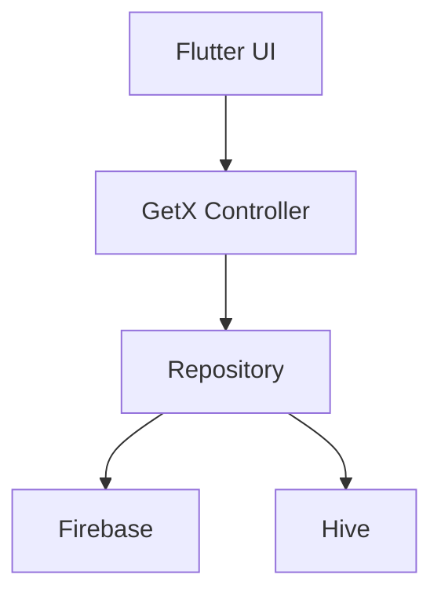
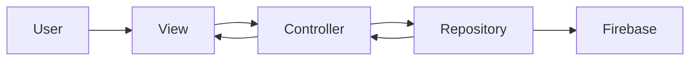
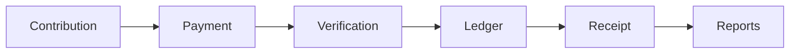
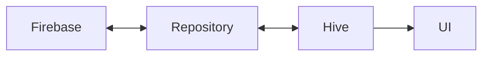

# ARCHITECTURE.md

> **AgePay System Architecture**
>
> Version: 1.0.0
>
> Last Updated: July 2026
>
> Status: Active

---

## Overview

AgePay is a multi-tenant contribution and financial management platform built using Flutter and Firebase.

The application follows a **Feature-First Architecture** combined with the **Repository Pattern** and **GetX** for state management.

The architecture is designed to be:

* Scalable
* Maintainable
* Secure
* Offline-First
* Financially Reliable

---

## Architecture Goals

* Separate UI from business logic.
* Keep business rules centralized.
* Support multiple organizations.
* Enable offline usage.
* Maintain financial integrity.
* Support future expansion.

---

## Technology Stack

| Layer            | Technology               |
| ---------------- | ------------------------ |
| Mobile           | Flutter                  |
| Language         | Dart                     |
| State Management | GetX                     |
| Backend          | Firebase                 |
| Database         | Cloud Firestore          |
| Authentication   | Firebase Authentication  |
| Local Storage    | Hive                     |
| Notifications    | Firebase Cloud Messaging |
| Payments         | Paystack, Flutterwave    |
| Version Control  | Git                      |

---

## High-Level Architecture



Repositories act as the single source of truth for application data.

---

## Project Structure

```text
lib/

core/

modules/

shared/

services/

routes/

theme/

main.dart
```

Each feature follows the same structure.

```text
feature/

├── bindings/
├── controllers/
├── models/
├── repositories/
├── services/
├── views/
└── widgets/
```

---

## Layer Responsibilities

## Views

Responsible for:

* Rendering UI
* Receiving user input
* Displaying state

Views must never access Firebase directly.

---

## Controllers

Responsible for:

* UI state
* User interactions
* Calling repositories
* Loading indicators
* Error handling

Controllers should not contain business logic.

---

## Repositories

Responsible for:

* Firestore operations
* Hive operations
* Business rules
* Synchronization
* Transactions
* Data validation

Repositories are the only layer that communicates with the database.

---

## Services

Responsible for external integrations such as:

* Authentication
* Notifications
* Payments
* Connectivity
* Storage

---

## Data Flow



---

## Multi-Tenant Architecture

Every organization has isolated data.

```text
Organization

├── Members

├── Contributions

├── Payments

├── Expenses

├── Meetings

├── Projects

└── Reports
```

Every business document contains:

* organizationId

All queries must be filtered by organization.

---

## Authentication Flow

```mermaid
flowchart TD

Login

-->

Firebase Authentication

-->

Load Organization

-->

Load Member Profile

-->

Load Permissions

-->

Dashboard
```

---

## Financial Flow



Financial records are immutable.

Corrections are performed through adjustment records.

---

## Offline Architecture



Repositories determine whether data is read from Firebase or Hive.

Offline changes are synchronized automatically.

---

## Firestore Organization

```text
organizations/

    organizationId/

        members/

        contributions/

        payments/

        expenses/

        meetings/

        projects/

        notifications/

        reports/
```

This structure ensures organization-level data isolation.

---

## Security Architecture

Security is enforced through multiple layers.

```text
Firebase Authentication

↓

Firestore Security Rules

↓

Organization Isolation

↓

Permission Checks

↓

Repository Validation
```

Each layer complements the others to protect sensitive data.

---

## Scalability

AgePay is designed to support:

* Small associations
* Religious organizations
* Alumni groups
* Cooperatives
* NGOs
* Large organizations with thousands of members

The modular architecture allows new features to be added without affecting existing modules.

---

## Core Architectural Principles

* Feature-First Structure
* Repository Pattern
* Separation of Concerns
* Offline-First Design
* Immutable Financial Records
* Permission-Based Authorization
* Single Source of Truth
* Multi-Tenant by Design

---

## Future Expansion

The architecture supports future modules including:

* Loan Management
* Investment Tracking
* Welfare Management
* Budget Planning
* Asset Management
* AI Treasurer
* AI Financial Advisor
* Advanced Reporting
* Web Dashboard

---

## Related Documents

* README.md
* AGENTS.md
* PROJECT_RULES.md
* docs/BusinessRules.md
* docs/FirestoreSchema.md
* docs/ContributionEngine.md

---

> **Next Document:** `PROJECT_RULES.md`
