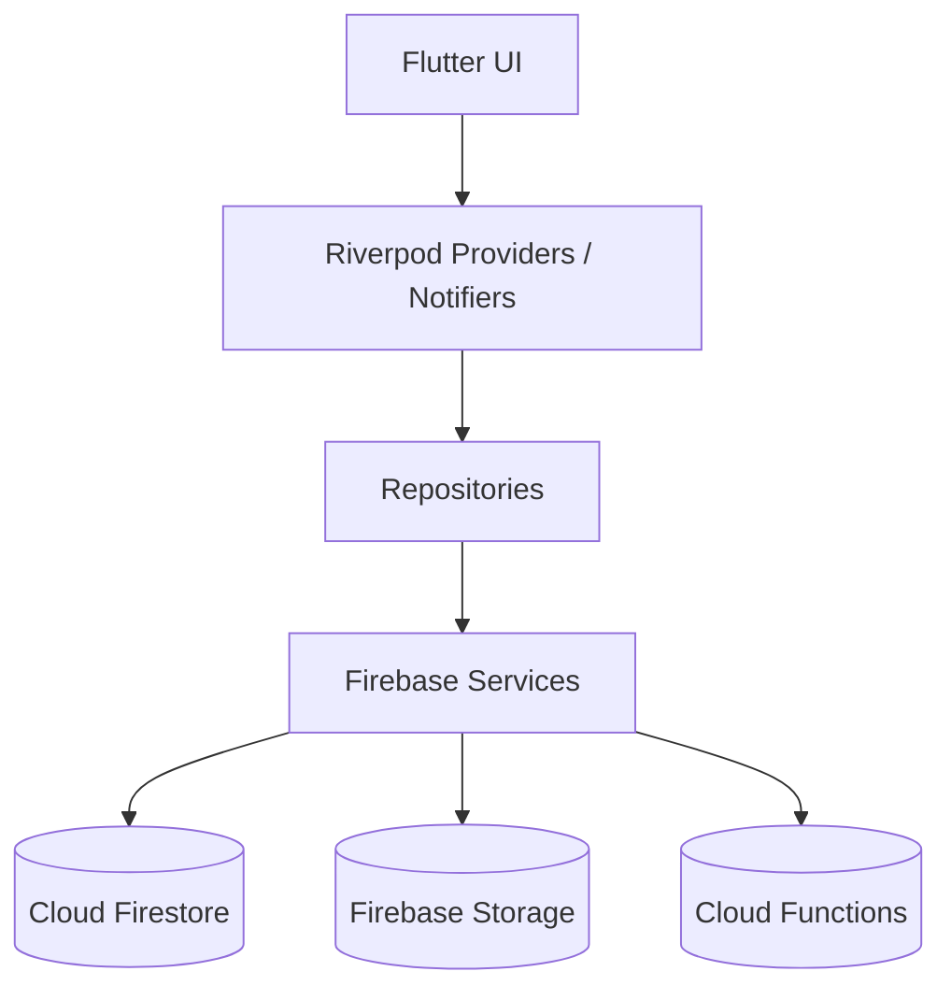

# AgePay


A modern community financial & management platform.


---

## Table of Contents

- [Introduction](#introduction)
- [Why AgePay?](#why-agepay)
- [Vision](#vision)
- [Mission](#mission)
- [Core Principles](#core-principles)
- [Key Features](#key-features)
- [Supported Organizations](#supported-organizations)
- [Technology Stack](#technology-stack)
- [Documentation](#documentation)
- [Project Status](#project-status)
- [Roadmap](#roadmap)
- [Project Architecture](#project-architecture)
- [Project Structure](#project-structure)
- [Getting Started](#getting-started)
- [Development Workflow](#development-workflow)
- [Coding Standards](#coding-standards)
- [Testing](#testing)
- [Contributing](#contributing)
- [Security](#security)
- [Frequently Asked Questions](#frequently-asked-questions)
- [License](#license)
- [Acknowledgements](#acknowledgements)
- [Maintainers](#maintainers)
- [Final Notes](#final-notes)

---

## Introduction

AgePay is a modern **Flutter-powered Community Financial Management Platform** designed to help organizations efficiently manage members, finances, meetings, projects, communication, and organizational activities from a single application.

Unlike traditional contribution tracking applications that focus only on payments, AgePay is designed to become the **operating system for community organizations**, combining financial transparency with collaboration and organizational management.

AgePay supports organizations of all sizes, enabling them to digitize their operations while maintaining accountability, transparency, and trust among members.

The application is built using **Flutter**, **Firebase**, and **Riverpod**, providing a fast, scalable, and offline-capable experience across Android and iOS devices.

---

## Why AgePay?

Many community organizations still rely on spreadsheets, notebooks, WhatsApp messages, and manual bookkeeping to manage finances and member activities.

These approaches often lead to:

- Missing payment records
- Financial disputes
- Poor accountability
- Lost receipts
- Difficult reporting
- Inconsistent member records
- Limited transparency
- Administrative overhead

AgePay solves these problems by providing a centralized platform where organizations can confidently manage:

- Members
- Executives
- Contributions
- Payments
- Expenses
- Meetings
- Attendance
- Projects
- Reports
- Notifications
- Documents
- Communication

All financial activities are recorded with an audit trail to ensure transparency and accountability.

---

## Vision

To become the leading digital platform for managing community organizations by simplifying financial management, improving transparency, and strengthening collaboration among members.

Our vision is to empower organizations with modern technology that reduces administrative work while increasing trust and accountability.

---

## Mission

AgePay exists to help organizations:

- Digitize financial operations
- Improve accountability
- Increase transparency
- Simplify administration
- Enhance member engagement
- Provide real-time financial insights
- Preserve historical organizational records
- Support future growth through scalable technology

---

## Core Principles

The design of AgePay is guided by several fundamental principles.

## Transparency

Every financial transaction should be traceable.

Nothing important should happen without a record.

---

## Accountability

Every action performed in the system should be attributable to a user.

Audit trails are a first-class feature.

---

## Simplicity

Powerful software does not need to be complicated.

The interface should remain clean, intuitive, and accessible to users with varying levels of technical expertise.

---

## Scalability

AgePay is designed to grow with organizations.

Whether an organization has:

- 20 members
- 200 members
- 2,000 members

the architecture should remain maintainable and performant.

---

## Security

Financial information is sensitive.

Security is considered at every layer of the application, including authentication, permissions, data validation, and storage.

---

## Offline First

Community organizations often operate in areas with unreliable internet connectivity.

AgePay supports offline usage wherever practical and synchronizes changes once connectivity is restored.

---

## What Makes AgePay Different?

Unlike simple contribution management applications, AgePay manages the entire lifecycle of an organization.

AgePay is built around the idea that every organization has:

- Members
- Leadership
- Financial responsibilities
- Meetings
- Projects
- Events
- Communication
- Reports
- Long-term records

Financial management is only one component of a larger organizational ecosystem.

---

## Key Features

AgePay provides a comprehensive set of modules.

## Member Management

- Member registration
- Member profiles
- Member search
- Membership status
- Profile photos
- Contact information
- Membership history

---

## Executive Management

Assign executive positions such as:

- President
- Vice President
- Secretary
- Treasurer
- Financial Secretary
- Auditor
- Public Relations Officer
- Trustee
- Committee Members

Executives remain members and retain their financial obligations unless explicitly exempted.

---

## Financial Management

- Registration fees
- Monthly dues
- Annual dues
- Levies
- Emergency contributions
- Project contributions
- Donations
- Fines
- Custom contribution categories

---

## Payment Management

Support for multiple payment channels:

- Paystack
- Manual Bank Transfer
- Cash Payments

Every payment includes:

- Payment reference
- Receipt
- Timestamp
- Status
- Audit history

---

## Expense Management

Organizations can manage:

- Operational expenses
- Project expenses
- Welfare expenses
- Administrative expenses

Each expense can follow an approval workflow.

---

## Meetings

Manage:

- Meeting schedules
- Attendance
- Agendas
- Minutes
- Resolutions
- Action items

---

## Projects

Organizations can create projects with:

- Budgets
- Contributions
- Expenses
- Timelines
- Completion reports

---

## Reports

Generate reports including:

- Financial statements
- Outstanding balances
- Income summaries
- Expense summaries
- Member statements
- Contribution reports
- Project reports

---

## Notifications

Members receive notifications for:

- Upcoming dues
- Payment confirmations
- Meeting reminders
- Announcements
- Project updates

---

## Offline Support

Payments can be recorded while connectivity is limited.

Cash and bank-transfer payments are submitted as pending records and reviewed by a treasurer once connectivity is restored.

---

## Supported Organizations

AgePay is designed to support a wide variety of organizations, including:

- Age Grade Associations
- Alumni Associations
- Cooperative Societies
- Religious Organizations
- Community Development Associations
- Student Associations
- Professional Bodies
- Non-Governmental Organizations (NGOs)
- Clubs and Societies
- Trade Associations
- Welfare Associations

The platform is multi-tenant, allowing multiple organizations to coexist while keeping their data securely isolated.

---

## Technology Stack

## Frontend

- Flutter
- Dart
- Material 3
- Riverpod

---

## Backend

- Firebase Authentication
- Cloud Firestore
- Firebase Storage
- Firebase Cloud Messaging
- Firebase Cloud Functions

---

## Architecture

- Feature-First Architecture
- Repository Pattern
- Riverpod State Management
- Offline-First Design
- Multi-Tenant Firestore Structure

---

## Payments

- Paystack
- Manual Bank Transfer
- Cash Payment Recording

---

## Documentation

This `README.md` is currently the primary project document.

Additional reference documentation (architecture, business rules, security, and coding standards) is planned under `docs/` and will be added as the project matures.

Every contributor is encouraged to read these documents before making changes to the codebase.

---

## Project Status

🚧 Active Development

AgePay is currently under active development.

Core modules are being implemented incrementally following a feature-first development approach.

The architecture is designed to support future expansion without major structural changes.

---

## Project Architecture

AgePay follows a **Feature-First Clean Architecture** built around Flutter, Riverpod, Firebase, and the Repository Pattern.

The architecture emphasizes:

- Separation of concerns
- Scalable feature development
- Testability
- Offline-first capabilities
- Financial data integrity
- Multi-tenant organization support



The application is designed so that **Views never communicate directly with Firebase**. All business logic flows through repositories, ensuring consistency, maintainability, and easier testing.

---

## Project Structure

The project uses a feature-first architecture to keep related code together and make the application easier to scale.

```text
age_grade_finance/

├── android/
├── ios/
├── assets/
│
│   ├── images/
│   ├── icons/
│   ├── fonts/
│   └── audio/
│
├── lib/
│
│   ├── core/
│   │
│   │   ├── constants/
│   │   ├── theme/
│   │   ├── utils/
│   │   └── widgets/
│   │
│   ├── data/
│   │
│   │   ├── models/
│   │   ├── repositories/
│   │   └── services/
│   │
│   ├── features/
│   │
│   │   ├── auth/
│   │   ├── dashboard/
│   │   ├── members/
│   │   ├── obligations/
│   │   ├── levies/
│   │   ├── payments/
│   │   ├── receipts/
│   │   ├── expenses/
│   │   ├── reports/
│   │   ├── notifications/
│   │   ├── admin/
│   │   └── splash/
│   │
│   └── main.dart
│
├── test/
├── functions/
├── README.md
└── pubspec.yaml
```

---

## Technology Decisions

| Layer | Technology |
| ----------| ----------------| |
| Frontend | Flutter |
| Language | Dart |
| State Management | Riverpod |
| Backend | Firebase |
| Authentication | Firebase Authentication |
| Database | Cloud Firestore |
| Storage | Firebase Storage |
| Notifications | Firebase Cloud Messaging |
| Payments | Paystack |
| Architecture | Repository Pattern |
| UI | Material 3 |

---

## Getting Started

## Requirements

Before running the application, ensure the following software is installed.

| Tool | Version |
| ---------| -----------| |
| Flutter | Latest Stable |
| Dart | Included with Flutter |
| Android Studio | Latest |
| Xcode (macOS) | Latest |
| Firebase CLI | Latest |
| Git | Latest |

Verify Flutter installation.

```bash
flutter doctor
```

All checks should pass before continuing.

---

## Clone the Repository

```bash
git clone https://github.com/YOUR_USERNAME/agepay.git
```

Navigate into the project.

```bash
cd agepay
```

---

## Install Dependencies

```bash
flutter pub get
```

---

## Firebase Configuration

AgePay uses Firebase for authentication, cloud storage, notifications, and Firestore.

Create a Firebase project.

Enable:

- Authentication
- Cloud Firestore
- Firebase Storage
- Cloud Messaging
- Cloud Functions

---

## Authentication Providers

Enable:

- Email & Password
- Google Sign-In

---

## Android Configuration

Download:

```bash
google-services.json
```

Place it inside:

```bash
android/app/
```

---

## iOS Configuration

Download:

```bash
GoogleService-Info.plist
```

Place it inside:

```bash
ios/Runner/
```

---

## Firestore

Create Firestore in Production Mode.

Configure security rules before deploying.

Never use test rules in production.

---

## Running the Application

Run on Android.

```bash
flutter run
```

Run on iOS.

```bash
flutter run -d ios
```

Build APK.

```bash
flutter build apk
```

Build App Bundle.

```bash
flutter build appbundle
```

Build iOS.

```bash
flutter build ios
```

---

## Development Workflow

Every new feature follows the same lifecycle.

```text
Business Requirement

↓

Planning

↓

Design

↓

Model

↓

Repository

↓

Controller

↓

View

↓

Testing

↓

Documentation

↓

Deployment
```

This workflow ensures consistency throughout the project.

---

## Feature Development

Every feature should contain:

```text
feature/

controllers/

views/

widgets/

providers/

models/

repository/
```

Avoid placing unrelated code inside a feature module.

Each feature should own its business logic.

---

## Dependency Injection

State and dependencies are managed with Riverpod.

Providers and notifiers are declared at the feature level and consumed via `ref.watch` / `ref.read` inside widgets.

Good:

```text
Provider / Notifier declaration

↓

Widget reads via ref.watch / ref.read

↓

Business Logic
```

Avoid manually constructing repositories or services inside widgets whenever possible.

---

## Repository Pattern

The application strictly follows the Repository Pattern.

```text
UI

↓

Controller

↓

Repository

↓

Firebase

↓

Firestore
```

Views must never communicate directly with Firebase.

---

## Offline Support Architecture

AgePay supports recording payments when connectivity is limited.

Cash and bank-transfer payments are stored as pending records in Firestore and verified by a treasurer once connectivity is restored.

Offline capabilities include:

- Cash payment recording
- Bank transfer submission
- Pending payment queue
- Receipt generation

When connectivity returns, queued payments are reviewed and verified through the normal approval workflow.

---

## Multi-Tenant Design

AgePay supports multiple organizations.

Every document stored in Firestore belongs to an organization.

```text
Organization

↓

Members

↓

Contributions

↓

Payments

↓

Reports
```

Data from one organization must never be visible to another.

Tenant isolation is a core architectural requirement.

---

## Screenshots

> Screenshots will be added as modules are completed.

| Screen | Preview |
| ---------- | ------------ |
| Splash | Coming Soon |
| Login | Coming Soon |
| Dashboard | Coming Soon |
| Members | Coming Soon |
| Contributions | Coming Soon |
| Reports | Coming Soon |

---

## Coding Standards

AgePay follows a consistent set of coding standards.

## General Principles

- Write readable code before clever code.
- Prefer explicit implementations over hidden abstractions.
- Keep widgets small and focused.
- Separate UI from business logic.
- Keep business rules inside repositories and services.
- Avoid duplicated logic.
- Favor composition over inheritance.

---

## Flutter Guidelines

- Use `const` constructors whenever possible.
- Use `final` for immutable variables.
- Follow Material 3 design principles.
- Avoid deeply nested widget trees.
- Build reusable widgets only when appropriate.
- Keep feature modules self-contained.

---

## Riverpod Guidelines

- Views should only build UI.
- Providers and notifiers manage presentation state.
- Repositories handle data access.
- Services interact with external systems.
- Declare providers at the feature level.
- Avoid placing business logic inside Views.

---

## Firebase Guidelines

- Never access Firestore directly from UI widgets.
- Validate data before writing to Firestore.
- Use transactions for financial operations where appropriate.
- Secure all collections with Firestore Security Rules.
- Never expose secrets in the client application.

---

## Testing

Every feature should be tested before merging.

Recommended commands:

```bash
flutter analyze
```

```bash
flutter test
```

For release builds:

```bash
flutter build appbundle
```

Contributors should ensure:

- No analyzer warnings.
- No failing tests.
- Stable UI in both light and dark themes.
- Offline functionality remains intact where applicable.

---

## Contributing

We welcome contributions that improve AgePay.

## Development Workflow Guide

1. Fork the repository.
2. Create a feature branch.
3. Implement the feature.
4. Run analysis and tests.
5. Update documentation if necessary.
6. Submit a pull request.

Branch naming examples:

```text
feature/member-search
feature/payment-history
fix/dashboard-refresh
refactor/member-repository
docs/update-readme
```

Commit message examples:

```text
feat: add contribution history screen

fix: resolve payment synchronization issue

refactor: simplify member repository

docs: update architecture guide
```

---

## Security Practices

AgePay manages sensitive financial information.

All contributors should follow these principles:

- Never commit secrets or API keys.
- Never bypass Firestore Security Rules.
- Validate user permissions before sensitive operations.
- Protect financial records from unauthorized modification.
- Record audit information for important actions.

Security issues should be reported privately to the maintainers.

---

## Roadmap

## Phase 1

- Authentication
- Organization Management
- Member Management
- Dashboard
- Contributions
- Payments
- Receipts

---

## Phase 2

- Expenses
- Meetings
- Attendance
- Notifications
- Reports
- Offline Synchronization

---

## Phase 3

- Projects
- Voting
- Document Management
- Budget Tracking
- Advanced Reporting

---

## Phase 4

- AI Treasurer
- AI Financial Advisor
- Predictive Analytics
- Budget Forecasting
- Loan Management
- Investment Tracking
- Welfare Management

---

## Frequently Asked Questions

### Why Flutter?

Flutter enables a single codebase for Android and iOS while delivering native performance and a consistent user experience.

### Why Riverpod?

Riverpod provides lightweight, testable state management and dependency injection, making feature development straightforward and maintainable.

### Why Firebase?

Firebase offers scalable authentication, database, storage, notifications, and cloud functions with minimal infrastructure management.

### Why Paystack?

Paystack provides a reliable, well-supported payment gateway for card and bank payments across Africa, with a straightforward API that integrates cleanly with Firebase.

---

## License

This project is licensed under the MIT License.

See the `LICENSE` file for more information.

---

## Acknowledgements

AgePay is inspired by the needs of community organizations seeking better financial transparency, accountability, and operational efficiency.

Special thanks to the Flutter and Firebase communities for the tools and resources that make projects like this possible.

---

## Maintainers

This project is maintained by the AgePay development team.

For questions, feature requests, or bug reports, please open an issue in the project repository.

---

## Final Notes

AgePay is more than a contribution management application.

It is a platform designed to help organizations build trust through transparency, simplify administration through technology, and preserve institutional knowledge for future generations.

Every design decision, line of code, and feature should align with the following principles:

- Transparency
- Accountability
- Simplicity
- Scalability
- Security
- Maintainability

Thank you for contributing to AgePay.

Together, we're building a modern platform that empowers communities to manage their finances and operations with confidence.
